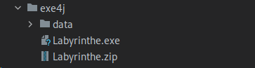
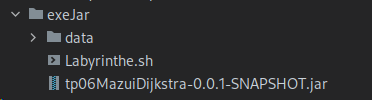
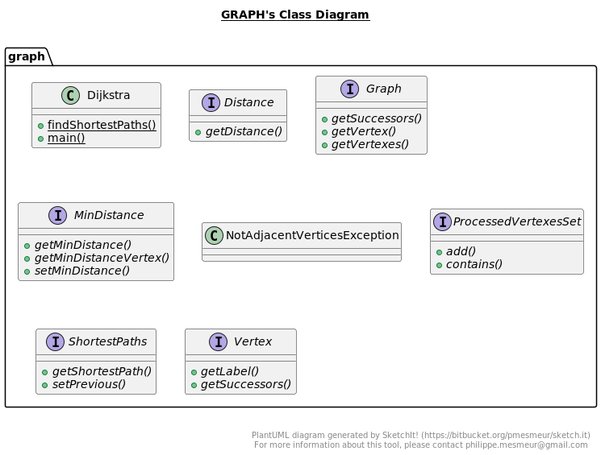
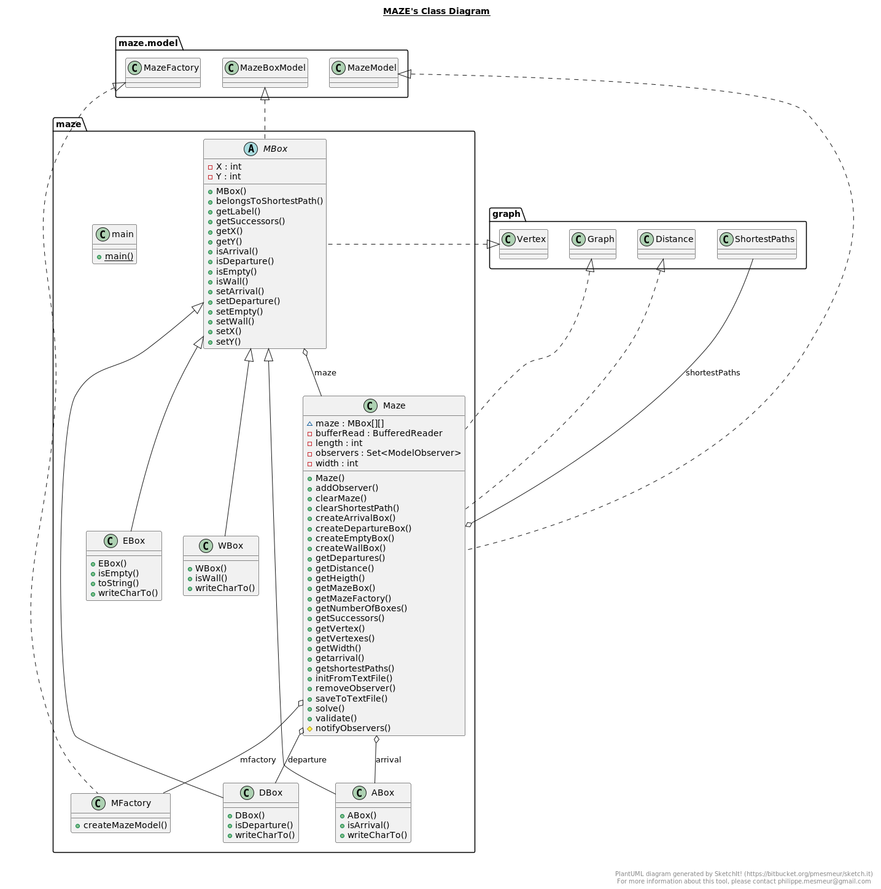

# **Windows**

Une archive éxécutable est disponible dans le répertoire exe4j sous le nom Labyrinthe.zip

Cette archive une fois dézippé permet de lancer le programme grace au fichier exécutable Labyrinthe.exe sous windows

# **Linux**

Lancer le fichier shell Labyrinthe.sh

Comme on peut le voir sur l’image ci-dessus, un labyrinthe, Maze en anglais, est représenté par une matrice de cases. Il
y une case marquée D pour départ et une case marquée A pour arrivée. Les cases vertes sont des cases où il est possible
de passer. Les cases grises sont des cases où il n’est pas autorisé de passer. En jaune, on voit le tracé d’un chemin
possible depuis la case de départ jusqu’à la case d’arrivée.

Un labyrinthe a une certaine largeur (ici 10) et une certaine hauteur (10 aussi). Une case est repérée par sa coordonnée
en largeur et sa coordonnée en hauteur. Ainsi, la case arrivée a comme coordonnées (8,6).

JavaDoc
=> http://localhost:63342/tp06MazeClass/javadoc/index.html?_ijt=b7poj32inena1ekne09pp7t38i&_ij_reload=RELOAD_ON_SAVE